# FinPay API

**[View Live Docs](https://devopschroniclesgit.github.io/finpay-api/)** &nbsp;|&nbsp;
**[GitHub Repository](https://github.com/devopschroniclesGit/finpay-api)**

FinPay is a production-style payment API built with Node.js, PostgreSQL, and Redis.
The architecture is inspired by the backend patterns of Stripe, PayFast, and Yoco —
focused on the correctness guarantees financial systems require: atomicity,
idempotency, and audit trails.

---

## Tech Stack

| Layer | Technology |
|---|---|
| Runtime | Node.js 20 |
| Framework | Express |
| Database | PostgreSQL 15 |
| ORM | Prisma |
| Cache / Rate Limiting | Redis 7 |
| Authentication | JWT + bcryptjs |
| Logging | Winston + Morgan |
| Documentation | Swagger / OpenAPI 3 |
| Containerisation | Docker Compose |

---

## System Architecture

The diagram below shows how every inbound request travels through the system.
Each layer in the middleware pipeline is a separate concern — if JWT auth fails,
the request never reaches the rate limiter. If the rate limiter fires, the
idempotency check never runs. If there is a cache hit, the database is never
touched.



> **Click any box in the interactive version** to go deeper on that component.
> The diagram is available at the live docs link above.

---

## Middleware Pipeline — In Order

Every request passes through these four layers before reaching business logic:

### 1. JWT Authentication

Validates the `Authorization: Bearer <token>` header. If the token is missing,
expired, or tampered with, the request is rejected with `401 Unauthorized` before
any other processing occurs. On success, the decoded `userId` is attached to the
request object for downstream use.

### 2. Redis Rate Limiter — Three Tiers

All counters live in Redis, not in memory. This means the limits hold correctly
whether you are running one Node.js instance or ten.

| Limiter | Target | Limit |
|---|---|---|
| Global | All `/api` routes | 100 requests / 15 minutes |
| Auth | `/api/v1/auth/*` | Tight limit — brute-force prevention |
| Transaction | `/api/v1/transactions` | Per-user transfer cap |

A request that hits the limit gets `429 Too Many Requests` and stops here.

### 3. Idempotency Key Check

The `X-Idempotency-Key` header is checked against Redis before any handler runs.

```
Request with X-Idempotency-Key: abc-123
        ↓
Redis lookup
  ├── Key found → return stored response immediately (no DB hit)
  └── Key missing → continue, store result after processing
```

New keys are written to both Redis (TTL-expiring) and PostgreSQL (durable audit
record). This is the same pattern Stripe uses — a client that retries a failed
network request gets the original response, not a duplicate charge.

### 4. Redis Response Cache

Read-heavy endpoints — account balance, transaction history — are served from
Redis without touching PostgreSQL on a cache hit. Only cache misses and write
operations continue to the service layer.

---

## Data Model

The schema is built around four tables with clear ownership:



Each user owns exactly one account. Transactions reference the accounts table
twice — `senderId` and `receiverId` — both wrapped in a single Prisma
`$transaction` block so the debit and credit are always atomic.

### Atomic Transfer — The Core Guarantee

```js title="src/services/transaction.service.js"
const result = await prisma.$transaction(async (tx) => {
  // Debit the sender
  const sender = await tx.account.update({
    where: { id: senderId },
    data: { balance: { decrement: amount } },
  });

  // Reject if balance goes negative
  if (sender.balance < 0) throw new Error('Insufficient funds');

  // Credit the receiver
  const receiver = await tx.account.update({
    where: { id: receiverId },
    data: { balance: { increment: amount } },
  });

  // Record the transaction
  return tx.transaction.create({
    data: { senderId, receiverId, amount, idempotencyKey },
  });
});
```

If any step throws — insufficient funds, database connection lost, anything — 
Prisma rolls back the entire block. Balance never goes negative. Value is never
lost between accounts. There is no partial state.

---

## API Endpoints

| Method | Endpoint | Description | Auth |
|---|---|---|---|
| `POST` | `/api/v1/auth/register` | Create user and wallet account | No |
| `POST` | `/api/v1/auth/login` | Authenticate and receive JWT | No |
| `GET` | `/api/v1/accounts` | Get own account balance | Yes |
| `POST` | `/api/v1/transactions` | Send money to another account | Yes |
| `GET` | `/api/v1/transactions` | List transaction history | Yes |
| `GET` | `/api/v1/health` | Service health check | No |

Full request/response schemas with interactive try-it-now at the
[Swagger UI](https://devopschroniclesgit.github.io/finpay-api/).

---

## Running Locally

```bash title="Terminal"
git clone https://github.com/devopschroniclesGit/finpay-api
cd finpay-api
cp .env.example .env
docker compose up -d        # starts PostgreSQL 15 + Redis 7
npm install
npx prisma migrate dev
npx prisma db seed
npm run dev                 # server at http://localhost:3000
```

**Seed accounts:**

| Email | Password | Balance |
|---|---|---|
| alice@finpay.dev | password123 | ZAR 10,000.00 |
| bob@finpay.dev | password123 | ZAR 5,000.00 |

---

## What This Project Demonstrates

**Correctness under failure.** Atomic transfers mean partial failures are impossible.
The system either completes a transfer or it does not.

**Distributed correctness.** Rate limit counters and idempotency keys in Redis
work correctly whether running one instance or ten.

**Observability from the start.** Structured logging and request tracing are part
of the middleware pipeline from the beginning — not added after the fact.

**Infrastructure as configuration.** PostgreSQL and Redis are provisioned via
Docker Compose. The entire infrastructure is version-controlled and reproducible
with one command.

---

## Roadmap

- GitHub Actions CI pipeline — lint, test, build on every push
- Containerised Node.js app — Docker image for the API
- Deployment to Railway or Render with health check integration
- Webhook events for transaction status changes
